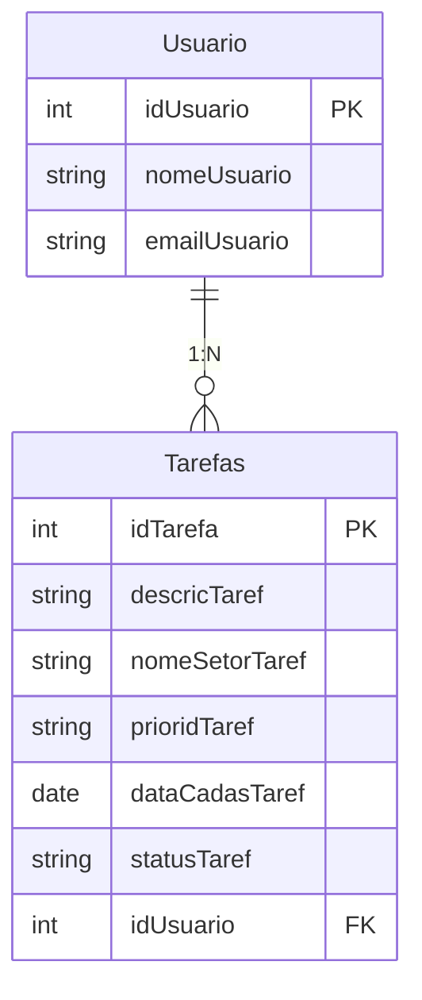
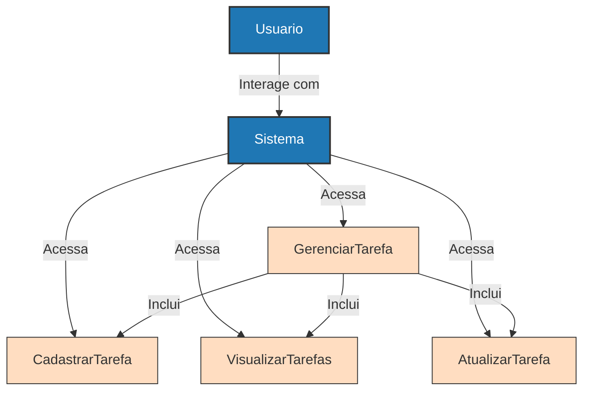

# Sistema de Gerenciamento de Tarefas

Este repositório contém diagramas e estrutura de banco de dados para o Sistema de Gerenciamento de Tarefas. Abaixo estão os diagramas de relacionamento e de casos de uso, que mostram a estrutura do banco de dados e as principais interações do sistema.

## Diagrama de Relacionamento

O diagrama ER (Entity-Relationship) a seguir mostra como as entidades `Usuario` e `Tarefas` estão associadas no sistema. Cada `Usuario` pode cadastrar múltiplas `Tarefas`, enquanto cada `Tarefa` está vinculada exclusivamente a um único `Usuario`.

## Diagrama de Casos de Uso
### O diagrama de casos de uso a seguir ilustra as principais interações dos usuários com o sistema. Ele inclui funcionalidades como cadastro, visualização, atualização e gerenciamento de tarefas.

## Estrutura do Banco de Dados Relacional

### -- Criação da tabela Usuario
### CREATE TABLE Usuario (
###     idUsuario SERIAL PRIMARY KEY,
###     nomeUsuario VARCHAR(255) NOT NULL,
###     emailUsuario VARCHAR(255) NOT NULL UNIQUE
### );
### 
### -- Criação da tabela Tarefas
### CREATE TABLE Tarefas (
###     idTarefa SERIAL PRIMARY KEY,
###     descricTaref TEXT NOT NULL,
###     nomeSetorTaref VARCHAR(255) NOT NULL,
###     prioridTaref VARCHAR(10) CHECK (prioridTaref IN ('baixa', 'media', 'alta')) NOT NULL,
###     dataCadasTaref DATE NOT NULL,
###     statusTaref VARCHAR(10) CHECK (statusTaref IN ('a fazer', 'fazendo', 'pronto')) NOT NULL,
###     idUsuario INT,
###     CONSTRAINT fk_usuario
###         FOREIGN KEY (idUsuario) 
###         REFERENCES Usuario(idUsuario) 
###         ON DELETE CASCADE
### );
